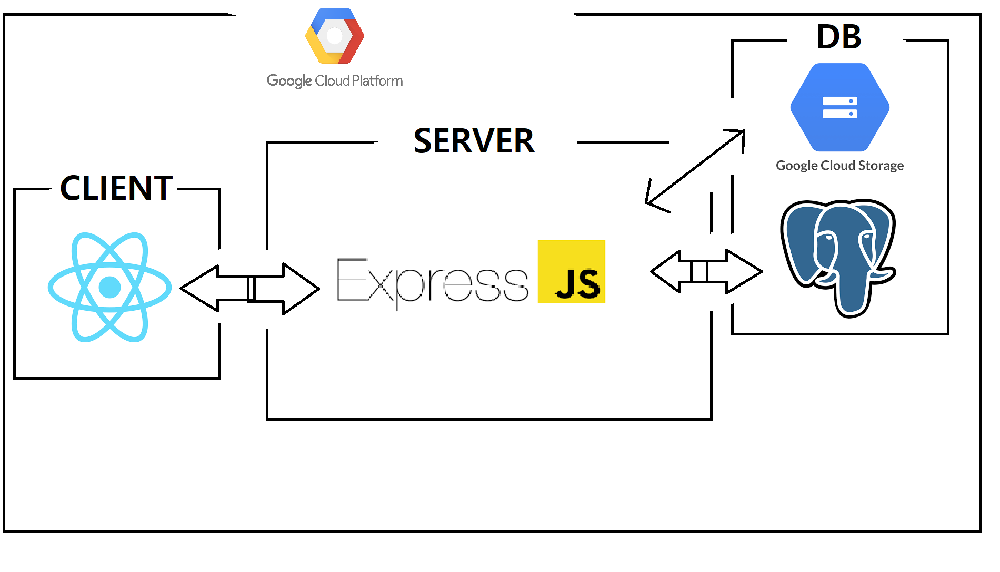

# Douda
도우다 
2024년 고등학교 프로젝트

<h2>웹사이트 링크</h2>
<a href="https://douda.kro.kr" style="color: lightblue;">👉 웹사이트 방문하기</a>

## 목차
- [프로젝트 소개](#프로젝트-소개)
- [구조](#구조)
- [기능](#기능)
- [기여 & 요청](#기여&요청)
- [라이선스](#라이선스)
- [문의](#문의)
- [팀원](#팀원)

## 프로젝트 소개

## 구조

## 기능

## 기여 & 요청

<a href="https://github.com/HolymolyAstatine/Douda/issues" style="color: lightblue;">👉 버그 신고(깃 허브 이슈)</a>  
<a href="https://github.com/HolymolyAstatine/Douda/pulls" style="color: lightblue;">👉풀 리퀘스트(환영!!)</a>  
<a href="https://github.com/HolymolyAstatine/Douda/issues" style="color: lightblue;">👉 기능 추가 요청(깃 허브 이슈로 해주세요)</a>  

## 라이선스
<h3>아무나 사용하셔도 됩니다.</h3>

## 문의
임시로 이메일 보내주세요 >> (kpa7089@gmail.com)  

## 팀원

| 이름     | 역할            | GitHub                           | 이메일               |
|----------|-----------------|----------------------------------|----------------------|
| 윤장호   | 프론트엔드 개발  | [GitHub](https://github.com/HolymolyAstatine)| kpa7089@gmail.com      |
| 정태원 | 백엔드 개발/프론트엔드 개발 | [GitHub](https://github.com/hafskjfha) | jtw7913@gmail.com |

